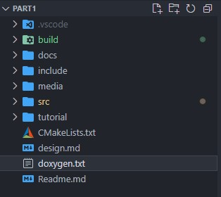
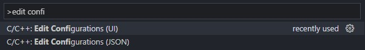
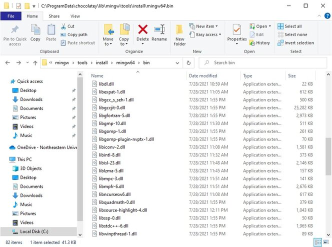
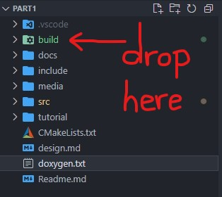
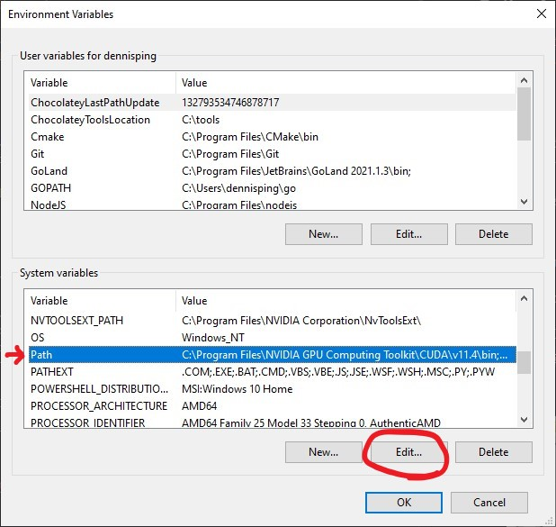

# How to setup C++, Cmake and Make to Work Natively in Windows 10 using MinGW

:rocket: **End goal: To create the same developer setup as Mac and Linux without having to rely on proprietary Microsoft Visual Studio (MSVC).**

**Note: You will need to run most commands as an Administrator in the Command Prompt.**

## :one: Install Chocolately

[Official Instructions](https://chocolatey.org/install)

### Why? We need a package manager

Linux has apt-get by default
```
sudo apt-get <packageName>
```

Mac has Homebrew
```
brew install <packageName>
```

Windows has Chocolately
```
choco install <packageName>
```

## :two: Recommend you install Windows Terminal and Powershell (Optional)

[Official Windows Terminal Instructions](https://docs.microsoft.com/en-us/windows/terminal/install)

The default Command Prompt sucks. :poop: It's like trying to build a house without power tools. We have technology.

[Official Powershell Instructions](https://docs.microsoft.com/en-us/powershell/scripting/install/installing-powershell-on-windows?view=powershell-7.1)

Set your default shell to Powershell. Don't use "Powershell Core"... that's a weird Microsoft project to try to get Linux and Mac users to switch to Powershell.

## :three: Install MinGW (GCC and G++ compiler)

MinGW-64 is the Windows equivalent of GCC (for C) and G++ (for C++). It even comes with the gdb debugger! :heart_eyes:

1. GCC :arrow_right: GNU C Compiler 
2. G++ :arrow_right: GNU C++ Compiler

```
choco install mingw
```

## :four: Install Cmake and Make

```
choco install cmake
```

```
choco install make
```

Add `cmake` as a command in your Environment Variables. There is a bug in the installer and it doesn't automatically create a command alias for you.

1. Search for `Environment Variables` in Windows
2. Click on `Environment Variables` button
3. In the upper window (user variables) click on `New`
4. Variable name = `cmake`
5. Variable path = `C:\Program Files\CMake\bin`
    - Please verify this path on your own computer
    - You will know this is the correct bin folder if it contains `cmake.exe`
6. Click `OK` and `OK` to finish

Check that MinGW, Cmake, and Make are installed correctly in the Terminal:
```
g++ --version
>>  g++.exe (MinGW-W64 x86_64-posix-seh, built by Brecht Sanders) 11.2.0
    Copyright (C) 2021 Free Software Foundation, Inc.

cmake --version
>>  cmake version 3.21.3

make --version
>>  GNU Make 4.3
    Built for Windows32
```

You can even check that other GNU tools from MinGW are installed:
```
grep --version
>> grep (GNU grep) 3.0

gdb --version
>> GNU gdb (GDB for MinGW-W64 x86_64, built by Brecht Sanders) 10.2

bash --version
>> GNU bash, version 5.0.17(1)-release (x86_64-pc-linux-gnu)
```

If you forget where G++ is installed, use this:

```
which g++
>>  /c/ProgramData/chocolatey/bin/g++
```

Refresh your Terminal environment variables with `refreshenv`

## :five: Download and Install SFML

[SFML Downloads Page](https://www.sfml-dev.org/download/sfml/2.5.1/)

1. Download GCC 7.3.0 MinGW (SEH) - 64-bit
    - Place this SFML folder somewhere safe like `C:\Users\yourname\Documents\`. Don't lose this folder!
    - We don't want the Visual C++ versions.
    - The 32-bit version should work as well if you want to use that instead.

2. We do NOT want to manually tell the GCC/G++ compiler where to find our SFML library. Doing this will suck because GCC/G++ and Cmake will not be able to find SFML by itself.
3. We WANT to add this SFML library as a `choco` package into our computer.
4. Use this Github code to help add SFML as a `choco` package.

    * Download all files from this Github repository: https://github.com/jeanmimib/sfml-mingw64
        ```
        git clone https://github.com/jeanmimib/sfml-mingw64.git
        ```
    * Place this folder into a temporary place like `C:\Users\yourname\Documents\`. You can delete this folder afterwards.
    * In the terminal, go into this temporary `sfml-mingw64` folder.
    * Type this command. It will create a nupkg file.
        ```
        choco pack
        ```
    * Type this command. It will install SFML as a choco package that MingGW can easily find. The dot means "here", and since you're in the same folder as the nupkg file, choco will find it.
        ```
        choco install sfml-mingw64 -s .
        ```
5. Check that all `choco` packages are installed correctly.
    ```
    choco list --local-only
    >>  Chocolatey v0.11.2
        cmake 3.21.3
        cmake.install 3.21.3
        make 4.3
        mingw 11.2.0
        sfml-mingw64 2.5.1  
    ```

Refresh your Terminal environment variables with `refreshenv`

## :six: Configure your IDE with working IntelliSense

1. I use Visual Studio Code (VS Code), so you will need to find the equivalent in your IDE.
2. Open up your VS Code such that the working folder is your desired Project Home.
   - You should see the `include` and `src` folders.
   - There are no parent folders above this folder!

    
3. Install the C/C++ extension (by Microsoft) because we want all the coding power we can get.
4. Install the Cmake Tools extension (by Microsoft) if you want. This is optional because we have already installed Cmake into our system. This Cmake extension only works inside VS Code and automatically builds your project when you save your files. This extension does not `make` an `.exe` file!
5. :bangbang: Because I have the Cmake tools extension, it generates a `/build` folder for me which is the same thing as `/bin`. :bangbang:
6. Open up the command palette with `ctrl + shift + p`.
7. Select `edit configuration (ui)` in the search bar.
   
   
8. Change the following configurations:

    | Configuration Name | Setting                                        |
    |--------------------|------------------------------------------------|
    | Compiler Path      | C:/ProgramData/chocolatey/bin/g++.exe          |
    | IntelliSense mode  | windows-gcc-x64                                |
    | Include Path       | ${workspaceFolder}/**                          |
    |                    | C:\Users\yourname\Documents\SFML-2.5.1\include |
    | C++ standard       | C++ 17                                         |

9.  Here we have 2 include paths. (1) The project's include and (2) SFML's include that you stored in a safe place. If you eventually have more external libraries, add them in "Include Path" as a new line.
10. Your IDE IntelliSense should now be happy. The red lines should go away because now it can find the .hpp files.

## :seven: Write your CMakeLists.txt

We are not going to use any absolute file paths. This usually leads to errors because the compiler can't find stuff.

```
cmake_minimum_required(VERSION 3.10)

project(
    App             # Name of our application
    VERSION 1.0     # Version of our software
    LANGUAGES CXX)  # Language that we are using

set(CMAKE_CXX_STANDARD 17)

include_directories("./include/")

find_package(SFML 2.5.1 COMPONENTS graphics window system REQUIRED)

add_executable(${PROJECT_NAME} ./src/App.cpp ./src/Draw.cpp ./src/Command.cpp ./src/main.cpp)

target_link_libraries(${PROJECT_NAME} sfml-graphics sfml-window sfml-system)
```

## :eight: Link the MinGW64 .dll libraries to your project

There are two ways to link .dll libraries in Windows 10.

### Option 1: You want to distribute the .exe program.

If you want to distribute a prebuilt .exe program, you should include the .dll libraries within the program files. Otherwise, a normal user will never be able to find & link the .dll libraries. You either provide all the necessary .dll  in one package, or you create a Windows installer (lmao).

1. Copy/paste all the MinGW .dll files into your project `/bin` or `/build` folder which contains the prebuilt .exe program.
2. For example, my .dll file location is: `C:\ProgramData\chocolatey\lib\mingw\tools\install\mingw64\bin`.
3. Use the search bar to filter by `.dll` and copy all.
   
    
4. Paste `.dll` files
   
    

### Option 2: You want to build the .exe program as a developer.

If you are a developer, you should let your computer automatically find the necessary `.dll` so that you don't have to copy/paste `.dll` every time to work on a new project.

1. Add the folder containing all the `.dll` libraries into your system PATH variable.
2. Go into Environment Variables again. Edit the Path variable.
   
   
3. Add the location for MinGW64 .dll folder into your PATH variable. For example, my location is: `C:\ProgramData\chocolatey\lib\mingw\tools\install\mingw64\bin`.
   
   

## :nine: Build your Project

  - Go into your project `/bin` or `/build` folder in the Terminal
  - Type `cmake -G "MinGW Makefiles ..` in the Terminal
  - This will **generate** the **makefiles** for the MinGW compiler
  - Type `make` in the Terminal
  - This will build your executible
  - Pray that it works :pray:
  - Try running the `App.exe`
  - Extra Notes:
    - It is good practice to build outside of your source directory. This is why we tell cmake to target one directory up (..)
    - After you run `cmake -G "MinGW Makefiles ..` one time, cmake will remember that you are using MinGW. So the next time you re-compile, you can just type `cmake ..`
    - If you ever delete your makefiles, you will need to re-generate them
  - VSCode Notes:
    - The VSCode cmake extension can auto generate the makefiles for you if you set it up correctly in the configuration (see step 6 above). It generates each time you hit save.

## :clapper: Demo of Native Windows Build

**https://streamable.com/jaevms**

## Help! It doesn't work

  - Restart your computer. Seriously, try it.
  - Delete the VSCode settings (in the folder called `.vscode`), restart VSCode, and re-apply the settings.
  - Windows is stubborn, so restart anything you can think of.